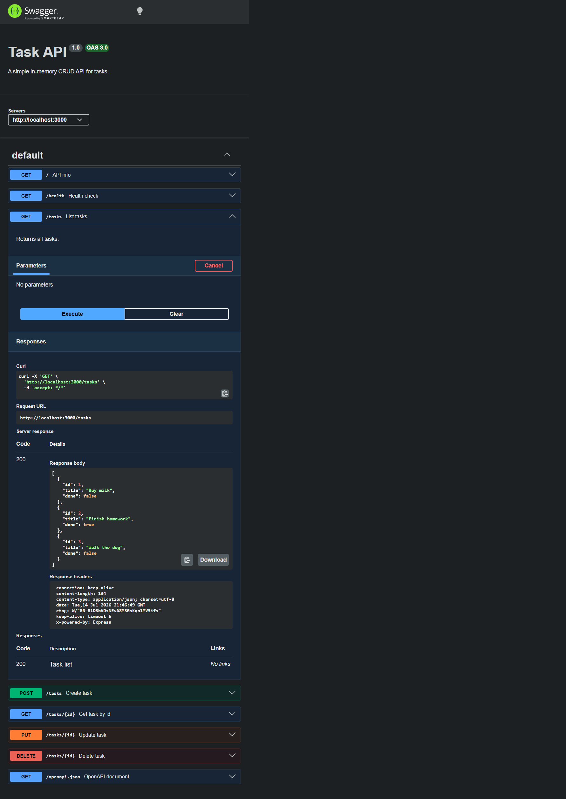
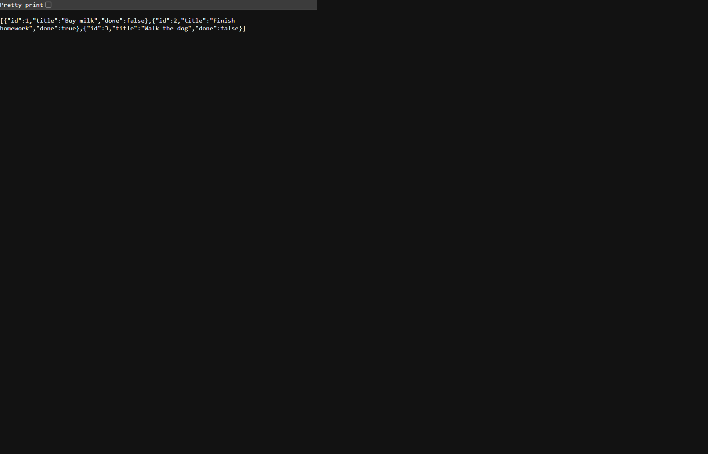
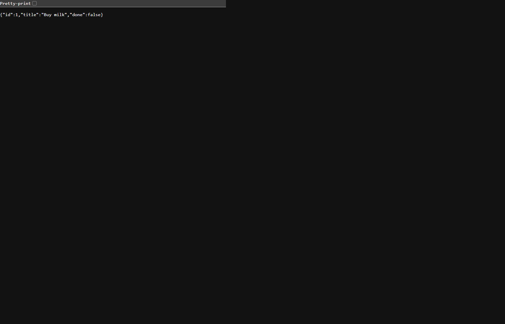

# Endpoints-API

I built this endpoints and tested with Swagger.It is a small Express app with in-memory tasks, so restarting the server clears the data.

## How to run

```bash
npm install
npm start
```

The app runs at `http://localhost:3000`.

## What is in it

| Method | Path | What it does |
| --- | --- | --- |
| GET | / | Basic API info |
| GET | /health | Health check |
| GET | /tasks | List all tasks |
| GET | /tasks/:id | Return one task |
| POST | /tasks | Create a task |
| PUT | /tasks/:id | Update a task |
| DELETE | /tasks/:id | Delete a task |
| GET | /docs | Swagger UI |
| GET | /openapi.json | OpenAPI file |

## Status codes I used

- `200` for reads and updates
- `201` for creating a task
- `204` for delete
- `400` for bad input
- `404` when the task id is not found

## Example response

```bash
curl -i http://localhost:3000/tasks/1
```

```text
HTTP/1.1 200 OK
Content-Type: application/json; charset=utf-8

{"id":1,"title":"Buy milk","done":false}
```

## Screenshots

I kept the screenshots under docs/screenshots so they are easy to find.








